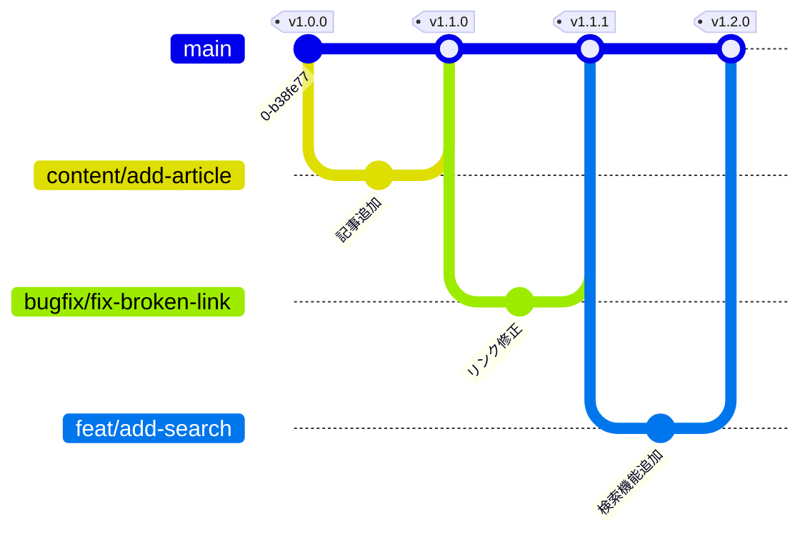

# Branch Strategy

- [GitHub Flow](https://docs.github.com/en/get-started/using-github/github-flow) をベースにしたブランチ戦略を採用
- `main` を唯一の統合ブランチとし，常にデプロイ可能な状態を保持
- すべての作業ブランチは `main` から分岐し，PRを通じて `main` にマージ



## 1. ブランチの種類

### Basic Syntax

```ini
<branch-type>/<task-description>
```

Issue番号は任意です．Issueに紐づく作業の場合は，トレーサビリティ向上のため番号を含めても構いません．

```ini
<branch-type>/<issue番号>-<task-description>
```

### 命名規則

| ブランチ種別 | 命名規則 | 目的 |
| --- | --- | --- |
| **本番用** | `main` | デプロイ可能な安定版．常にリリース済みの状態を保持 |
| **記事作成** | `content/<タスク>` | 記事の新規作成・追記 |
| **校正・修正** | `typos/<タスク>` | 誤字脱字の校正，文言・表現の修正 |
| **機能追加** | `feat/<タスク>` | 新機能追加や改善タスク |
| **バグ修正** | `bugfix/<タスク>` | 機能の不具合修正 |

### 命名例

| ブランチ名 | 用途 |
| --- | --- |
| `content/add-shell-tips` | 記事作成 |
| `typos/fix-intro-typo` | 校正・修正 |
| `feat/add-search` | 機能追加 |
| `bugfix/fix-broken-link` | バグ修正 |
| `feat/0123-add-search` | 機能追加（Issue番号付き） |

## 2. 開発フロー

### Step 1. ブランチ作成

作業内容に応じたブランチ種別を選び，`main` から分岐します．

```bash
git switch main
git pull
git switch -c content/add-shell-tips
```

### Step 2. コミット

作業をこまめにコミットします．

```bash
git add .
git commit -m "content: シェル小技の記事を追加"
```

### Step 3. Push と PR 作成

```bash
git push -u origin content/add-shell-tips
```

- `main` へのPRを作成
- レビュー／CIを通過させてからマージ
- ローカルで直接マージする場合は `git merge --no-ff` を使用

### Step 4. リリース

- `_quarto.yml` 等の version を更新し，`main` へのマージ時にリリース
- PRマージ時に自動でタグ付け・リリースノート作成を実施（CI設定による）

## 3. ブランチ削除ポリシー

| ブランチ種別 | 削除タイミング | 備考 |
| --- | --- | --- |
| `content` / `typos` / `feat` / `bugfix` | main マージ後 | 即削除（必要ならタグで履歴追跡） |

## 4. 注意事項

### Rule 1: 小文字とハイフンを使用する

- ブランチ名は常に小文字で記述
- 大文字を含めると，ファイルシステムが大文字・小文字を区別する環境がある
- 単語の区切りにはハイフン（`-`）を使用

**📘 Example**

- ✅ Good: `feat/user-login`
- ❌ Avoid: `Feat_UserLogin`, `FeatUserLogin`

### Rule 2: 明確なトークンからブランチ名を開始する

- 各ブランチ名は，目的を示すカテゴリトークンから始めます．
- トークンの例：
  - `content`（記事作成）
  - `typos`（校正・修正）
  - `feat`（機能追加）
  - `bugfix`（バグ修正）
- トークンと説明文はスラッシュ（`/`）で区切る

**📘 Example**

- ✅ Example: `bugfix/payment-timeout`
- ❌ Avoid: `payment-timeout` (purpose unclear)

### Rule 3: ブランチ名は簡潔・明確に

- 意図を説明できる範囲で，長すぎる名前は避ける
- 長すぎるブランチ名は，ログ表示の一行に収まらず，可視性が下がるため

**📘 Example**

- ✅ 良い例: `feat/api-headers`
- ❌ 悪い例: `feat/update-the-way-we-handle-request-headers-in-api`

### Rule 4: 衝突を生む可能性のあるブランチは作らない

- `git switch -c feat` のように意図が不明瞭な名前や既存ブランチと衝突する可能性のある名前は避ける
- Gitは内部的に ブランチ名をパス（ディレクトリ構造）として管理しているため，`feat` が作成されていると `feat/login-v2` が名前衝突して作成できなくなってしまう
  - 同じ階層にファイルとディレクトリを同時に作れないため

**📘 Example**

```bash
$ git switch -c bugfix/fix-login-error
Switched to a new branch 'bugfix/fix-login-error'

$ ls .git/refs/heads/bugfix
fix-login-error
```
